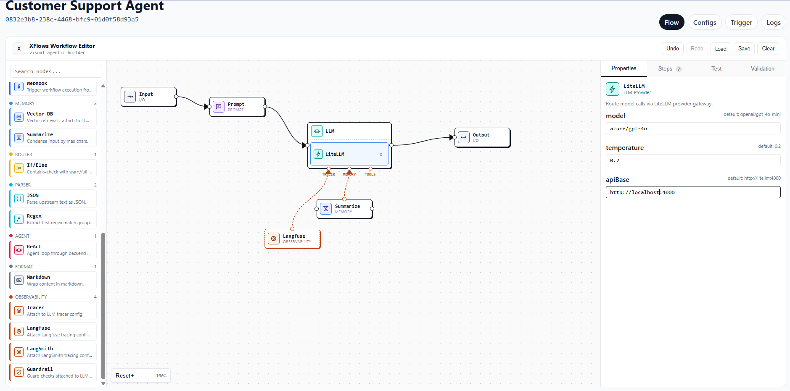

# XFlows

XFlows is evolving from a browser-only proof of concept into a production-grade
agentic workflow platform.

## Repository Layout

- `apps/web`: Frontend application (React UI and workflow authoring surface)
- `apps/api`: FastAPI gateway for workflow CRUD, run management, and run streams
- `apps/workers`: Temporal workers and activity executors
- `packages/workflow-spec`: Shared workflow schema, versioning rules, and examples
- `deploy/docker`: Docker Compose deployment assets for single-VM runtime
- `docs/architecture`: Target architecture, lifecycle, and integration guidance
- `docs/runbooks`: Operational runbooks for deployment and troubleshooting

## POC to Production Migration Map

The original POC remains at repository root and serves as a compatibility
reference while production apps are scaffolded.

- `XFlows.html` -> `apps/web` (frontend shell and bundling pipeline)
- `app.jsx` -> `apps/web` (state management and editor runtime)
- `catalog.js` -> `packages/workflow-spec` + worker activity registry
- `codegen.js` -> `packages/workflow-spec` + Temporal workflow executor
- `component-panel.jsx`, `canvas.jsx`, `param-modal.jsx`, `steps-pane.jsx` ->
  `apps/web` component tree

## Execution Model

- Authoring and testing: Web client calls API.
- Orchestration: API starts Temporal workflows.
- Execution: Worker activities perform node-level work.
- Inference: LiteLLM routes requests to OpenAI, Ollama, or vLLM.
- Observability: Langfuse traces and Prometheus metrics.

## Node System (Current)

The workflow engine now uses a registry-based backend and a JSON-driven frontend catalog.

- Backend node dispatch:
  - `apps/api/app/nodes`
  - `apps/workers/app/nodes`
- Frontend node catalog:
  - `apps/web/src/features/workflow/catalog/node-registry.json`

### Built-in Integration Nodes

The platform includes first-class nodes for:

- `LiteLLM`
- `Webhook`
- `ApiCaller`
- `LangfuseTracer`
- `LangsmithTracer`

Provider nodes nested under an `LLM` container are promoted into executable runtime
nodes during graph normalization, so provider params are applied during actual runs.

## Project Configs and Test Runs

Project-level runtime configs are now derived from the active nodes in the flow:

- Config requirements are declared in `node-registry.json` under `projectConfigs`.
- The Configs tab renders required fields dynamically based on flow nodes.
- Test runs use project configs from `project.configs` via run metadata
  (`metadata.runtimeConfig`), not per-session API key input in the test panel.

This allows provider settings (for example LiteLLM base URL, API key, and model) to
be managed in one place and used consistently by local and worker execution.

## LiteLLM Model Naming Note

XFlows sends LiteLLM model names exactly as configured (no auto-trimming of prefixes).

- If your LiteLLM requires `openai/gpt-4o`, use that exact value.
- If your LiteLLM exposes alias-style names like `gpt-4o-mini`, use that exact alias.
- On failure, node errors include provider/model context and LiteLLM response body to
  speed up debugging.

See `docs/architecture/generic-nodes-backend.md` for backend extension patterns and
node implementation details.
