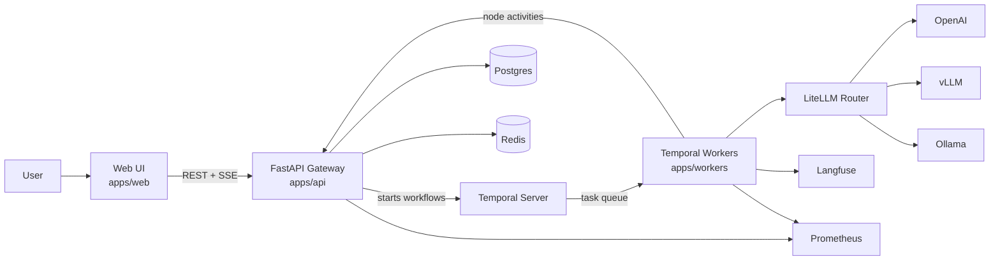

# XFlows Documentation

XFlows is an agentic workflow platform: author workflows visually in the browser, execute them
durably on a Temporal worker fleet, route model inference through LiteLLM, and observe
every run with live event streams, Langfuse traces, and Prometheus metrics.

This is the full documentation set. Start with [Getting Started](getting-started.md) or jump
to any section below.

## Documentation Map

| Section | Contents |
|---|---|
| **Getting started** | [Quickstart, first workflow, first run](getting-started.md) |
| **Architecture** | [Architecture overview](architecture/overview.md) — services, runtime topology, request flows, data/control planes, reliability |
| | [Target architecture](architecture/target-architecture.md) — goals and topology decisions |
| | [Workflow lifecycle](architecture/workflow-lifecycle.md) — draft/published/archived + run lifecycle |
| | [Generic nodes backend](architecture/generic-nodes-backend.md) — node engine design + how to add nodes |
| | [Persistence migration](architecture/persistence-migration.md) — memory → Postgres rollout stages |
| | [Integrations](architecture/integrations.md) — LiteLLM, Ollama, vLLM, Langfuse blueprint |
| | [Observability & evaluation](architecture/observability-evaluation.md) — trace model, metrics, SLOs |
| **Features** | [Feature map & user journeys](features/overview.md) |
| | [Workflow editor](features/workflow-editor.md) — canvas, nodes, edges, containers, undo/redo, validation |
| | [Node catalog](features/node-catalog.md) — all 36 components, params, config slots |
| | [Projects, configs & triggers](features/projects-configs-triggers.md) — dashboard, Configs tab, Trigger tab |
| | [Runs](features/runs.md) — test runs, run history, live view, event streaming |
| **Reference** | [REST API reference](reference/api-reference.md) — every endpoint with payloads |
| | [Run events](reference/run-events.md) — event contract + SSE protocol |
| | [Data model](reference/data-model.md) — entities, Postgres schema, store modes, caching, idempotency |
| | [Node execution engine](reference/node-execution.md) — normalization, dispatch, executors, model routing |
| | [Configuration](reference/configuration.md) — every environment variable per service |
| | [Workflow spec](reference/workflow-spec.md) — JSON schema, TS types, versioning rules |
| **Operations** | [Deployment (Docker Compose)](deployment/docker-compose.md) — profiles, services, ports, healthchecks |
| | [Deploy on a single VM](runbooks/deploy-single-vm.md) — step-by-step runbook |
| | [Observability](observability.md) — metrics, alert rules, Langfuse traces, SLOs |
| | [Local development](guides/development.md) — running each app, tests, eval harness |

## What XFlows Does



- **Author** workflows on a drag-and-drop canvas (`apps/web`), backed by a JSON node catalog
  (`apps/web/src/features/workflow/catalog/node-registry.json`).
- **Execute** them via the API (`apps/api`), which starts Temporal workflows on the
  `xflows-workflows` task queue. If Temporal is unavailable, the API runs the same node engine
  locally so the test panel always shows real output.
- **Execute nodes** as Temporal activities in `apps/workers`, with retries, timeouts, and
  per-node event emission back to the API.
- **Route models** through LiteLLM (`/v1/chat/completions`) with a fallback model chain.
- **Persist** everything in Postgres (workflows, runs, events, triggers), accelerated by Redis.

## Repository Layout

```
xflows/
├── apps/
│   ├── web/          # React + Vite frontend (authoring, run UX, SSE rendering)
│   ├── api/          # FastAPI gateway (CRUD, run lifecycle, SSE streams, local fallback)
│   └── workers/      # Temporal worker + activity executors + model router + tracing
├── packages/
│   └── workflow-spec/  # Shared schema (JSON Schema + TS types), versioning rules, examples
├── deploy/docker/    # Docker Compose profiles: core + observability
├── migrations/       # Original browser-only POC (compatibility reference)
├── tools/evals/      # Regression evaluation harness against the API
└── docs/             # This documentation
```

## Conventions Used in These Docs

- **Current vs planned**: behavior described as *current* is implemented in code;
  behavior marked *planned* (e.g., `published`/`archived` workflow publishing flow) exists only
  in target docs and the shared spec, not yet as working endpoints.
- File paths are relative to the repository root.
- Diagrams use Mermaid and are intended to be rendered by any Markdown viewer with Mermaid
  support (GitHub, GitLab, VS Code with extensions).
