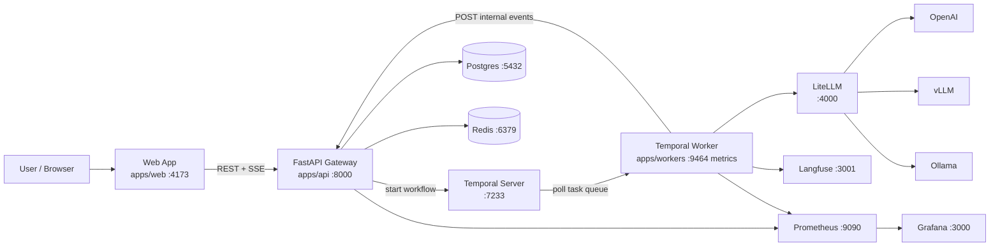
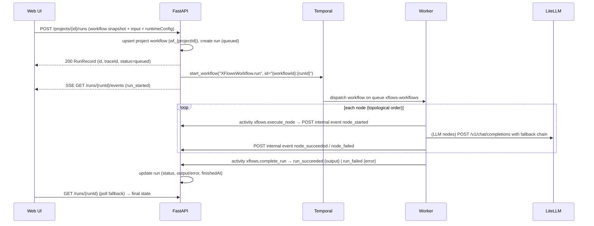

# Architecture Overview

This is the end-to-end architecture of XFlows as implemented today. Companion docs:
[target architecture goals](target-architecture.md), [workflow lifecycle](workflow-lifecycle.md),
[node engine design](generic-nodes-backend.md), [persistence migration](persistence-migration.md),
[integrations](integrations.md), [observability](observability-evaluation.md).

## Design Goals

- **Durable execution** — every run is a Temporal workflow: retries, resumability, and a
  deterministic history per run.
- **No browser secrets** — model/provider credentials live in project configs and server
  settings; the browser only ever holds project-level config values it submits for its own runs.
- **Provider portability** — all inference flows through one OpenAI-compatible endpoint
  (LiteLLM), so OpenAI, vLLM, and Ollama are interchangeable.
- **Uniform node engine** — the exact same graph normalization + registry dispatch runs in the
  Temporal worker and in the API's local fallback, so behavior is identical either way.
- **Live run visibility** — per-node events stream to any consumer over SSE with resume support.

## Runtime Topology



## Service Boundaries

| Service | Path | Responsibility | Stack |
|---|---|---|---|
| **Web** | `apps/web` | Workflow authoring, project workspace (flow/configs/trigger/logs), test runs, live view, SSE rendering | React 18 + Vite 5, custom SVG canvas, react-router v6, hand-written CSS |
| **API** | `apps/api` | Workflow/project/trigger/user CRUD, run creation & orchestration boundary, SSE event streams, worker event ingestion, Prometheus metrics, local fallback execution | FastAPI, Pydantic v2, asyncpg, redis-py, sse-starlette, prometheus-client, temporalio |
| **Workers** | `apps/workers` | Execute `XFlowsWorkflow` on task queue `xflows-workflows`; per-node activities; LiteLLM routing; Langfuse tracing; node metrics | temporalio, httpx, langfuse, prometheus-client |
| **Workflow spec** | `packages/workflow-spec` | Shared contract: JSON Schemas, TypeScript types, versioning rules, example workflow | JSON Schema 2020-12, raw TS module |
| **Deploy** | `deploy/docker` | Compose profiles `core` and `observability`; Prometheus scrape + alert rules; LiteLLM config | Docker Compose |

The original browser-only POC lives in `migrations/` as a compatibility reference (see the
root README migration map).

## Control Plane

- **Temporal task queue**: `xflows-workflows`
- **Registered workflow**: `XFlowsWorkflow.run` (entrypoint `run(workflow_def_payload, user_input, run_id, trace_id, runtime_config)`)
- **Temporal workflow id**: `{workflowId}:{runId}` — one Temporal workflow per run
- **Registered activities**: `xflows.execute_node`, `xflows.complete_run`
- The API **starts** workflows and never blocks on them (`client.start_workflow`, fire-and-forget);
  completion arrives via worker → API event callbacks.

## Data Plane

| Store | Used for |
|---|---|
| **Postgres** | Source of truth: `users`, `projects`, `workflows`, `triggers`, `runs`, `run_events`, `idempotency_keys` |
| **Redis** | Hot cache (`project:{id}`, `projects:list`, `run:{id}`, TTL 30s) + graceful degradation when absent |
| **Temporal history** | Deterministic execution log / replay source per run |
| **SSE stream** | `GET /runs/{runId}/events` — cursor-based replay over `run_events.id` |

Run **events** are the append-only history: the worker POSTs each event to
`POST /internal/runs/{runId}/events` (token-guarded), the API appends it to `run_events`
(monotonic BIGSERIAL id), and SSE consumers read them by cursor. The API applies terminal
side-effects when it sees `run_started` / `run_succeeded` / `run_failed` (updating `runs.status`,
`output`, `error`, timestamps).

Run **state** (`queued → running → succeeded | failed`) lives on the `runs` record; see
[Run events reference](../reference/run-events.md) and
[Data model](../reference/data-model.md).

## End-to-End Run Flow



Key properties:

- **Idempotent creation**: `RunRequest.idempotencyKey` + workflow id map to a single run for the
  TTL (default 24h), enforced with a Postgres advisory lock.
- **Trace id**: `trace_{uuid4hex16}` generated at run creation; flows into Temporal, events, and
  Langfuse.
- **Local fallback**: if Temporal is unreachable at start time, the API runs the *same* node
  engine in a background task and emits identical events, so the client experience is unchanged.

## Node Execution Engine (shared by worker and API fallback)

```
raw graph (React-Flow style)
  → normalize_workflow_graph()   # promote provider children into containers; keep data edges only
  → topological sort (Kahn)      # cycle detection
  → NodeGraphRunner.run()        # sequential; single-input (last incoming edge wins)
      per node: registry.dispatch(componentId) → NodeExecutionResult
  → output = first node with componentId "Output" (else last node)
```

- Executors are injected with a `NodeExecutionContext` (`llm_chat`, `http_request`, run ids,
  `runtime_config`), keeping executors pure and testable — see
  [node execution reference](../reference/node-execution.md).
- Built-in component ids: `Input`, `PromptTemplate`, `Output`, `LLM`, `OpenAIChat`,
  `AnthropicChat`, `ReActAgent`, `LiteLLM`, `HttpRequest`, `ApiCaller`/`ApiCall`,
  `Webhook`/`WebhookTrigger`, `LangfuseTracer`, `LangsmithTracer`; unknown component ids fall
  through to a `PassthroughExecutor`.
- Model routing (worker): `params.model → runtimeConfig.litellmModel → fallback chain`
  (`openai/gpt-4o → vLLM Llama-3.1-8B → Ollama llama3.1:8b`); details in
  [node execution reference](../reference/node-execution.md#model-routing-fallback-chain).

## Extensibility Points

- **New node type** — implement a `BaseNodeExecutor`, register it in both
  `apps/api/app/nodes/factory.py` and `apps/workers/app/nodes/factory.py`, add tests, and add it
  to `node-registry.json`. Full guide:
  [Generic nodes backend](generic-nodes-backend.md#how-to-add-a-new-node-type).
- **New provider backend** — register the model alias in `deploy/docker/litellm_config.yaml`;
  client-side nothing changes (model names are sent verbatim).
- **New event consumer** — subscribe to the SSE stream or poll
  `GET /runs/{runId}/events/history`; the event contract is versioned in
  `packages/workflow-spec/run-events.schema.json`.

## Security Posture (current)

- No user-facing authentication yet; CORS restricted to configured origins
  (`CORS_ORIGINS`, default localhost:4173).
- The only protected endpoint is the internal worker callback
  (`x-internal-token` header ↔ `INTERNAL_API_TOKEN`); unset token disables the check.
- Secrets live in project `configs` (stored server-side in Postgres) and service env vars.
- Planned (per target docs): auth/RBAC, secret boundary enforcement, circuit breakers,
  per-provider concurrency limits, dead-letter handling — see
  [target architecture](target-architecture.md#reliability-controls).

## Frontend Persistence Model

The web app is **offline-first**: every project mutation writes to localStorage
(`xflows_projects`, `src/lib/projectStore.js`) immediately and then syncs to the REST API with
graceful degradation — if the API is down, the UI keeps working from local state and reconciles
on next load (it even auto-creates the remote project if `GET /projects/:id` 404s). Details in
[Projects, configs & triggers](../features/projects-configs-triggers.md).
