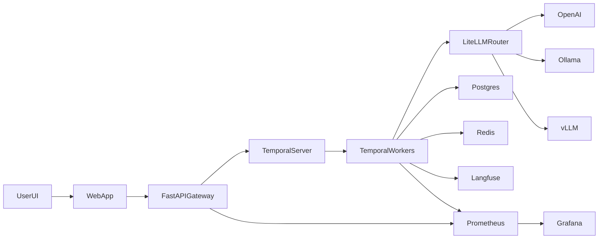

# XFlows Target Architecture

## Goals

- Durable workflow execution with retries and resumability
- Secure server-side model/tool execution with no browser secrets
- Provider portability across OpenAI, Ollama, and vLLM
- First-class tracing and operational metrics

## Runtime Topology

## Service Boundaries

- `apps/web`: workflow authoring, run UX, event stream rendering
- `apps/api`: workflow CRUD, run lifecycle APIs, orchestration boundary
- `apps/workers`: Temporal workflow and activity execution runtime
- `packages/workflow-spec`: shared schema contracts and version rules

## Project Routing Contract

- `/project/{uuid}/flow`: workflow canvas editor
- `/project/{uuid}/trigger`: trigger table and trigger creation
- `/project/{uuid}/logs`: historical runs table with status and deep links
- `/project/{uuid}/run/{runId}`: run control and test execution for a single run
- `/project/{uuid}/view/{runId}`: live read-only visualization for the same run

## Data Plane

- **Postgres**: workflow metadata, run state, audit metadata
- **Redis**: transient event fan-out, idempotency cache, rate limits
- **Temporal history**: deterministic execution log and replay source
- **Run event stream**: worker emits node/run events via API internal endpoint for SSE consumers

## Control Plane

- **Temporal task queue**: `xflows-workflows`
- **Workflow id format**: `{workflowId}:{runId}`
- **Idempotency scope**: `(workflowId, idempotencyKey)`

## Reliability Controls

- Retry policy on node activities (`max_attempts=3`, exponential backoff)
- Dead-letter pattern for exhausted failures
- Circuit breaker pattern for model provider instability
- Per-provider concurrency limits and timeout budgets
