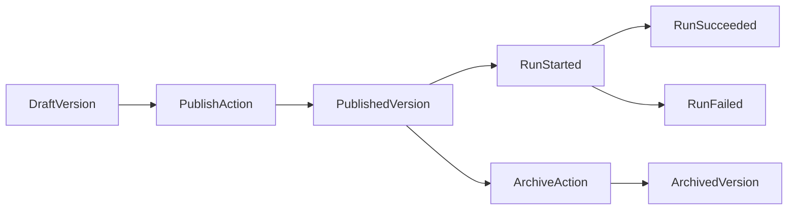

# Workflow Lifecycle

## States

- `draft`: editable version under active development
- `published`: immutable executable version
- `archived`: preserved but not executable

## Lifecycle Flow

## Run Lifecycle

1. API receives `POST /workflows/{id}/runs`.
2. API checks idempotency and creates run record.
3. API starts Temporal workflow `XFlowsWorkflow.run`.
4. Worker executes nodes through activities and provider/tool adapters.
5. Events are emitted (`run_started`, node events, terminal run event).
6. API serves live event stream through `GET /runs/{id}/events`.

## Project Journey Lifecycle

1. User creates a project and receives a UUID from `POST /projects`.
2. User is routed to `/project/{uuid}/flow` to build the graph.
3. User manages schedules/webhooks from `/project/{uuid}/trigger`.
4. User reviews execution history in `/project/{uuid}/logs`.
5. User starts a test run through `/project/{uuid}/run/{runId}`.
6. User observes the same run in `/project/{uuid}/view/{runId}` using SSE node updates.

## Versioning Rules

- Runs must bind to exact `workflowId + version`.
- Published versions are immutable.
- Replays always execute using original version semantics.
- Breaking node behavior changes require new publish version.
