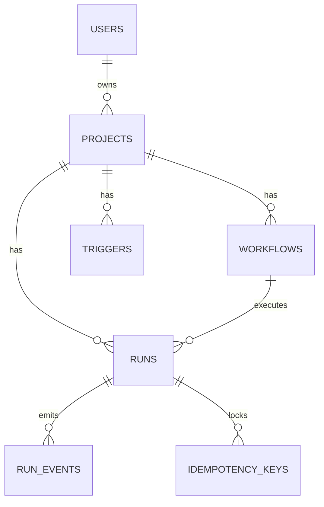

# Data Model

Entities, storage modes, caching, and idempotency. Schema source: `apps/api/db/schema.sql`
(mirrored as `SCHEMA_SQL` in `apps/api/app/persistence.py`, applied automatically when
`SCHEMA_AUTO_MIGRATE=true`). Store implementations: `apps/api/app/store.py`.

## Entity Overview

## Tables

All created with `CREATE TABLE IF NOT EXISTS` (schema auto-migration). Timestamps are
`TIMESTAMPTZ`.

### `users`
| Column | Type | Notes |
|---|---|---|
| id | UUID PK | |
| email | TEXT UNIQUE NOT NULL | lowercased by the store |
| name | TEXT | |
| auth_provider | TEXT | default `'local'` |
| created_at / updated_at | TIMESTAMPTZ | |

### `projects`
| Column | Type | Notes |
|---|---|---|
| id | TEXT PK | client-supplied or uuid |
| owner_user_id | UUID → users(id) | ON DELETE SET NULL |
| name / description | TEXT | |
| graph | JSONB | default `{"nodes":[],"edges":[]}` |
| configs | JSONB | project runtime config (see [Configs tab](../features/projects-configs-triggers.md#configs-tab)) |
| metadata | JSONB | |
| last_run | JSONB | summary mirror written by the web client |
| created_at / updated_at | TIMESTAMPTZ | |

### `workflows`
| Column | Type | Notes |
|---|---|---|
| id | TEXT PK | e.g. `wf_support_assistant`, `wf_{projectId}`, `wf_web_editor_<ts>` |
| project_id | TEXT → projects(id) | ON DELETE SET NULL; from `metadata.projectId` |
| name / description | TEXT | |
| version | INTEGER | default 1 |
| status | TEXT | default `'draft'` |
| definition | JSONB | `{nodes, edges, metadata}` together |
| created_at / updated_at | TIMESTAMPTZ | |

**Versioning facts (current behavior)**: workflows are created with `version=1`, `status='draft'`.
`upsert_workflow` overwrites `definition` (and name/description) but keeps `version` and `status`.
History is captured at the **run** level (each run snapshots `workflow_version`); there is no
version-history table or publish endpoint yet — the draft/published/archived model is specified
in [workflow-spec versioning](../../packages/workflow-spec/versioning.md) as the target.

### `triggers`
| Column | Type | Notes |
|---|---|---|
| id | TEXT PK | `trg_<10 hex>` |
| project_id | TEXT → projects(id) | NOT NULL, ON DELETE CASCADE |
| type | TEXT | `time` \| `webhook` \| `event` |
| enabled | BOOLEAN | default true |
| config | JSONB | e.g. `{queue, time, timezone}` |
| created_at / updated_at | TIMESTAMPTZ | |

### `runs`
| Column | Type | Notes |
|---|---|---|
| id | TEXT PK | `run_<16 hex>` |
| project_id | TEXT → projects(id) | ON DELETE SET NULL |
| workflow_id | TEXT → workflows(id) | NOT NULL, ON DELETE CASCADE |
| workflow_version | INTEGER | snapshot at run creation |
| status | TEXT | `queued` \| `running` \| `succeeded` \| `failed` \| `cancelled` |
| input / output / error | TEXT | output and error nullable |
| trace_id | TEXT | `trace_<16 hex>` |
| metadata | JSONB | includes `runtimeConfig` |
| started_at / finished_at | TIMESTAMPTZ NULL | |
| created_at | TIMESTAMPTZ | |

### `run_events`
| Column | Type | Notes |
|---|---|---|
| id | BIGSERIAL PK | monotonic; the SSE cursor |
| run_id | TEXT → runs(id) | NOT NULL, ON DELETE CASCADE |
| node_id | TEXT NULL | |
| event_type | TEXT | one of the six event types |
| payload | JSONB | |
| trace_id | TEXT NULL | |
| occurred_at | TIMESTAMPTZ | |

### `idempotency_keys`
| Column | Type | Notes |
|---|---|---|
| workflow_id + idempotency_key | composite PK | scope of dedup |
| run_id | TEXT → runs(id) | ON DELETE CASCADE |
| expires_at | TIMESTAMPTZ | default TTL 24 h |
| created_at | TIMESTAMPTZ | default NOW() |

## Indexes

- `idx_projects_updated_at` — dashboard ordering
- `idx_workflows_project_id`, `idx_workflows_created_at` (embedded schema)
- `idx_runs_project_id`, `idx_runs_workflow_id`
- `idx_runs_started_created` — on `COALESCE(started_at, created_at) DESC`
- `idx_run_events_run_id_id` — SSE/history scans
- `idx_idempotency_expiry` — TTL cleanup

## Store Implementations

`create_store(settings)` (`apps/api/app/persistence.py`) picks by `PERSISTENCE_MODE`:

| Mode | Class | Behavior |
|---|---|---|
| `memory` | `InMemoryStore` | Dict-backed; events with in-memory counter; idempotency index in memory. For tests/dev |
| `postgres` (default) | `PostgresStore` | asyncpg pool (1–10 conns), optional Redis cache; schema auto-applied when enabled |
| `dual` | `DualWriteStore` | Writes to memory **and** Postgres; reads from SQL when `PERSISTENCE_READS_FROM_SQL=true` — for migration shadowing |

Postgres availability: if the pool or schema bootstrap fails, startup errors surface; Redis is
best-effort (a failed ping degrades to `None` with a warning, never a crash).

## Redis Caching (PostgresStore)

- TTL: `CACHE_TTL_SECONDS` (default 30).
- Cached keys: `project:{id}`, `projects:list`, `run:{id}`.
- Invalidation: project/trigger mutations delete `project:{id}` + `projects:list`;
  `update_run` deletes `run:{id}` (+ a legacy `runs:project:*` key).
- Reads fall through to Postgres on miss; everything works without Redis.

## Idempotency

Run creation (`PostgresStore.create_run`) is wrapped in a transaction:

1. `pg_advisory_xact_lock(advisory_key("{workflow_id}:{idempotency_key}"))` — serializes
   concurrent duplicate requests (8-byte blake2b digest as the lock key).
2. Lookup in `idempotency_keys` for an unexpired entry → return the existing run.
3. Otherwise insert the run (`queued`) and the key with
   `expires_at = now + IDEMPOTENCY_TTL_SECONDS` (default 86400), upserting on conflict.

In `InMemoryStore` the same semantics come from the `idempotency_index` map. Without an
idempotency key, every request creates a new run.

## Deletion Cascades

- Delete run → its events and idempotency keys go too.
- Delete project → triggers cascade; workflow/run `project_id` references are nulled.
- There are no DELETE HTTP endpoints yet; cascades exist at the schema level.

## Entity → Pydantic Mapping

All API models are Pydantic v2 with camelCase fields (`apps/api/app/models.py`);
the worker mirrors the workflow-side models in `apps/workers/app/models.py`; the TypeScript
contract lives in `packages/workflow-spec/src/types.ts`. Keep the three in sync when changing
shapes (see [workflow spec](workflow-spec.md)).
